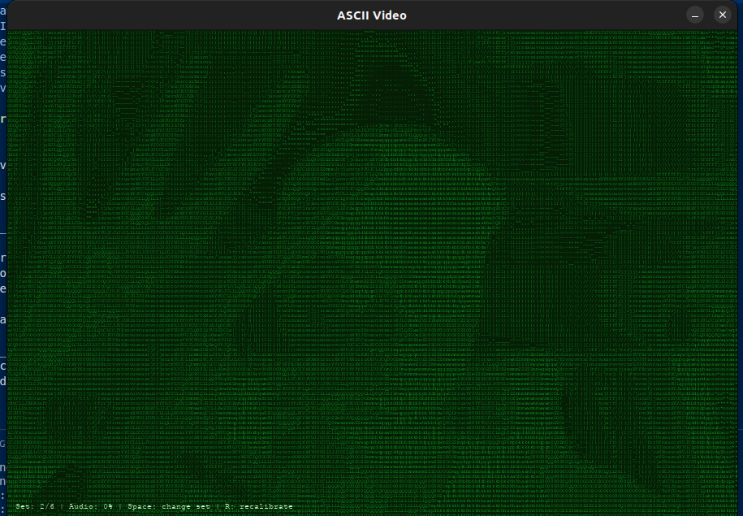

# ASCII Video Converter

A real-time video to ASCII art converter with audio reactivity and character rotation effects.



## Features

- Converts webcam video to ASCII art in real-time
- Multiple ASCII character sets that rotate automatically
- Audio reactive effects that respond to microphone input
- Retro green terminal aesthetic
- Adjustable display resolution and font size
- Side-by-side view of original video and ASCII conversion

## Directory Structure

```
ascii-video-converter/
├── README.md                   # Project documentation
├── requirements.txt            # Dependencies
├── src/
│   ├── __init__.py             # Package initialization
│   ├── main.py                 # Main application script
│   ├── audio_processor.py      # Audio capture and processing
│   ├── ascii_converter.py      # Video to ASCII conversion logic
│   └── character_sets.py       # Different ASCII character sets
├── images/
│   └── demo-placeholder.png    # Screenshot for README
```

## Installation

1. Clone the repository:
   ```
   git clone https://github.com/yourusername/ascii-video-converter.git
   cd ascii-video-converter
   ```

2. Create a virtual environment (optional but recommended):
   ```
   python -m venv venv
   source venv/bin/activate  # On Windows: venv\Scripts\activate
   ```

3. Install the required packages:
   ```
   pip install -r requirements.txt
   ```

## Usage

Run the main application:

```
python -m src.main
```

### Controls

- **Q or ESC**: Quit the application
- **SPACE**: Manually change between different ASCII character sets
- **Make noise**: The display reacts to sounds detected by your microphone

## Requirements

- Python 3.6+
- OpenCV
- NumPy
- PyAudio
- Pygame

## How It Works

1. **Video Capture**: The application captures frames from your webcam using OpenCV.

2. **ASCII Conversion**: Each frame is resized, converted to grayscale, and mapped to ASCII characters based on pixel brightness.

3. **Display**: The ASCII representation is displayed in a Pygame window with a green terminal theme.

4. **Audio Processing**: The microphone input is analyzed to determine volume levels which influence the visual effects.

5. **Character Sets**: The application cycles through different character sets to create varying visual effects.

## Customization

You can modify the following aspects of the application by editing the `main.py` file:

- **Font Size**: Change the `font_size` variable
- **Window Dimensions**: Adjust the `ascii_width` and `ascii_height` variables
- **Character Sets**: Edit the `char_sets` list in `character_sets.py`
- **Color Scheme**: Modify the `background_color`, `text_color_bright`, and `text_color_dim` variables
- **Rotation Speed**: Change the `rotation_interval` variable

## Troubleshooting

### Audio Issues

If you encounter problems with audio detection:

1. Make sure your microphone is properly connected and enabled
2. Check that you have granted the application permission to access your microphone
3. Try adjusting the audio sensitivity in `audio_processor.py`

### Video Issues

If the webcam isn't working:

1. Ensure no other applications are using your webcam
2. Try changing the camera index in `main.py`: `cap = cv2.VideoCapture(0)` (try 1, 2, etc.)
